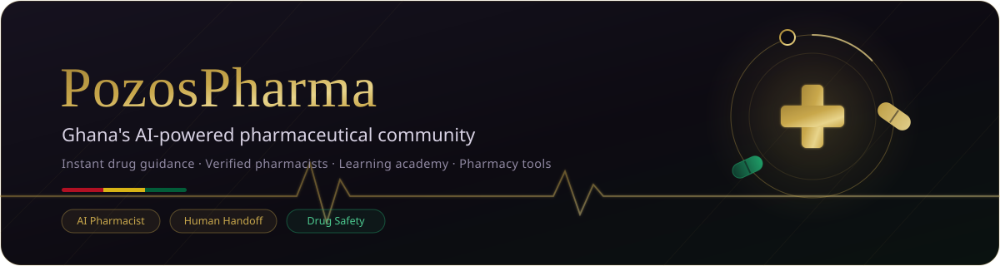
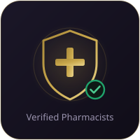
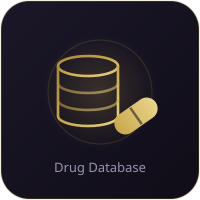
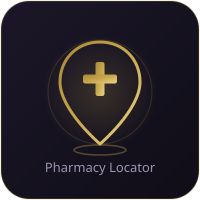
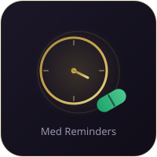
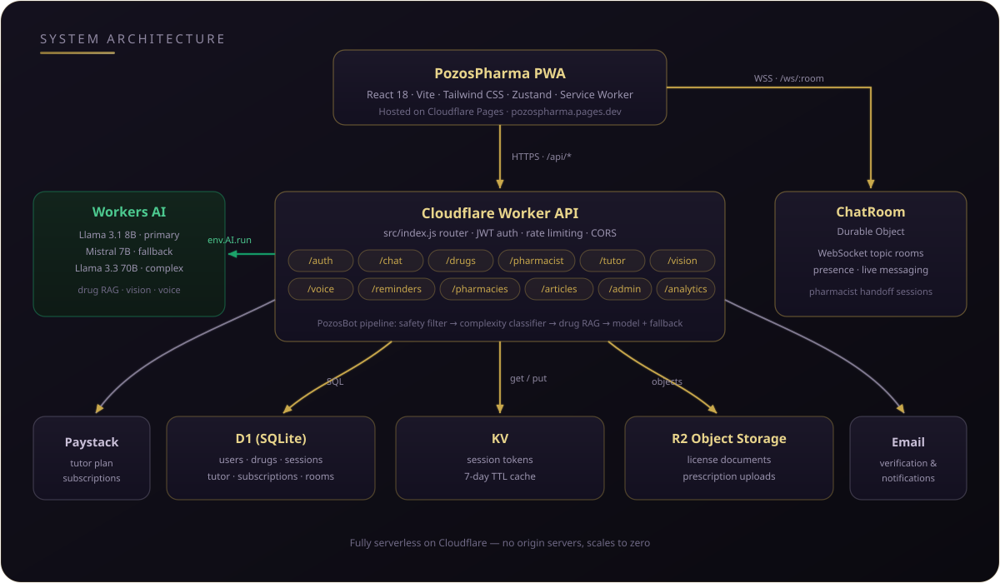

<p align="center">
  
</p>

<p align="center">
  
  
  
  
  
  
  
  
</p>

<p align="center">
  <strong>Instant, trustworthy pharmaceutical guidance for every Ghanaian —<br/>
  powered by AI, backed by real, licensed pharmacists.</strong>
</p>

---

## Table of Contents

- [Overview](#overview)
- [Key Features](#key-features)
- [Architecture](#architecture)
- [Tech Stack](#tech-stack)
- [Getting Started](#getting-started)
- [Project Structure](#project-structure)
- [Roadmap](#roadmap)
- [Contributing](#contributing)
- [License](#license)

## Overview

**PozosPharma** is a progressive web app that puts a pharmacy in every pocket in Ghana. Ask **PozosBot** — an AI pharmaceutical assistant grounded in a database of drugs actually sold on the Ghanaian market — about dosages, side effects, and interactions, in plain language. When a question needs human judgement, the session is handed off live to a **verified pharmacist registered with the Pharmacy Council of Ghana**.

Beyond chat, the platform is a full pharmaceutical toolkit: a drug database with Ghanaian brand names (Efpac, Coartem, Lonart...), interaction and herbal-remedy checkers, a pharmacy locator, medication reminders, an emergency drug finder, NHIS lookup, and a complete **learning academy** for pharmacy students — courses, quizzes, flashcards, a drug-calculation trainer, and an AI tutor.

Everything runs **fully serverless on Cloudflare** — no origin servers, scaling to zero when idle.

## Key Features

<table>
  <tr>
    <td align="center" width="33%">
      <br/>
      <strong>PozosBot AI Assistant</strong><br/>
      <sub>Drug-RAG-grounded answers with a complexity classifier that routes simple questions to Llama 3.1 8B and complex ones to Llama 3.3 70B, with Mistral 7B as fallback. Built-in safety filters, emergency-keyword escalation, and Ghana-aware guidance.</sub>
    </td>
    <td align="center" width="33%">
      <br/>
      <strong>Live Pharmacist Handoff</strong><br/>
      <sub>Type <code>/pharmacist</code> to escalate any AI session to a verified, licensed pharmacist. Real-time consultation over WebSockets, an urgency-ranked handoff queue, video-call UI, ratings, and a pharmacist portal with leaderboards.</sub>
    </td>
    <td align="center" width="33%">
      <br/>
      <strong>Drug Intelligence</strong><br/>
      <sub>Searchable database of Ghanaian-market drugs, drug–drug and herbal interaction checkers, pill identifier, prescription scanner (vision AI), drug verification, price tracking, and a shortage radar.</sub>
    </td>
  </tr>
  <tr>
    <td align="center" width="33%">
      <br/>
      <strong>Pharmacy &amp; Care Tools</strong><br/>
      <sub>Pharmacy locator, emergency drug finder, NHIS lookup, and a dedicated Community Health Worker (CHW) mode for frontline health workers.</sub>
    </td>
    <td align="center" width="33%">
      <br/>
      <strong>Learning Academy</strong><br/>
      <sub>E-learning portal with courses, quiz engine, flashcards, drug-calculation trainer, compounding lab, and a subscription-based AI pharmacy tutor (Paystack billing).</sub>
    </td>
    <td align="center" width="33%">
      <br/>
      <strong>My Medications</strong><br/>
      <sub>Personal medication schedules with reminders, an adherence calendar, and heat-storage alerts for Ghana's climate — all offline-capable thanks to the PWA shell.</sub>
    </td>
  </tr>
</table>

Plus: nine moderated **community topic rooms** (chronic conditions, pediatrics, women's health, herbal &amp; traditional, oncology and more) with live chat, voice input and voice consultations, a health-hub article library, multilingual UI scaffolding (i18n), and an admin panel with analytics.

Verified pharmacists also have a **PSGH-aligned Practice Hub** for de-identified clinical intervention documentation. It provides 30-day safety and condition-category metrics, idempotent offline capture for unstable connections, pharmacist-scoped CSV exports, and direct access to clinical safety tools. It is an alignment workspace, not an official PSGH, NHIA, FDA, or Pharmacy Council submission portal.

## Architecture

<p align="center">
  
</p>

- **Frontend** (`frontend/`) — a React 18 + Vite PWA served from Cloudflare Pages. Zustand stores, Tailwind styling, a service worker, and an offline IndexedDB layer keep the app usable on flaky connections.
- **Backend** (`worker/`) — a single Cloudflare Worker (`src/index.js`) routing JSON API calls for auth, chat, drugs, pharmacists, tutoring, vision, voice, reminders, pharmacies, articles, admin, and analytics.
- **Realtime** — WebSocket upgrades on `/ws/:room` are pinned to a **ChatRoom Durable Object**, giving each community room and pharmacist session a strongly-consistent live channel.
- **AI pipeline** — incoming messages pass a safety filter and complexity classifier, get enriched with drug context via **RAG** (`worker/src/ai/drugRAG.js`), then run on Workers AI with automatic fallback between models.
- **Data** — D1 (SQLite) for relational data, KV for session tokens, R2 for license documents and uploads. Paystack handles tutor subscriptions; transactional email handles verification.

## Tech Stack

| Layer | Technology |
| --- | --- |
| Frontend | React 18, Vite 5, React Router 6, Zustand 5, Tailwind CSS 3 |
| Backend | Cloudflare Workers (ES modules, `nodejs_compat`) |
| Database | Cloudflare D1 (SQLite) — schema in `schema.sql`, seed data in `drugs-seed.sql` |
| Storage | Cloudflare KV (sessions), R2 (documents & uploads) |
| Realtime | Durable Objects + WebSockets (`ChatRoom`) |
| AI | Workers AI — Llama 3.1 8B (primary), Mistral 7B (fallback), Llama 3.3 70B (complex) |
| Payments | Paystack subscriptions |
| Auth | JWT (signed with `JWT_SECRET`) + KV-backed sessions |
| Tooling | Wrangler 3, PostCSS, PWA service worker |

## Getting Started

**Prerequisites:** Node.js 18+, npm, and a Cloudflare account with [Wrangler](https://developers.cloudflare.com/workers/wrangler/) authenticated (`npx wrangler login`).

### 1. Backend — Cloudflare Worker

```bash
cd worker
npm install
npm run dev        # wrangler dev → http://localhost:8787
```

Initialize the D1 database (run once):

```bash
npm run db:init                              # remote database (as configured)
npx wrangler d1 execute pozospharma-db --local --file=../schema.sql   # local dev database
```

Existing environments can apply the Practice Hub migration separately after review:

```bash
npx wrangler d1 execute pozospharma-db --local --file=src/migrations/2026-08-12-practice-hub.sql
```

Set the required secrets:

```bash
npx wrangler secret put JWT_SECRET
npx wrangler secret put PAYSTACK_SECRET_KEY   # only needed for tutor subscriptions
```

### 2. Frontend — React PWA

```bash
cd frontend
npm install
npm run dev        # vite → http://localhost:3000
```

The Vite dev server proxies `/api` and `/ws` to the Worker on `localhost:8787`, so run both.

### 3. Deploy

```bash
cd worker && npm run deploy                                        # Worker → Cloudflare
cd frontend && npm run build \
  && npx wrangler pages deploy dist --project-name=pozospharma     # PWA → Cloudflare Pages
```

## Project Structure

```
pozos-pharma/
├── schema.sql                  # D1 schema: users, pharmacists, drugs, sessions, tutor tables
├── drugs-seed.sql              # Ghanaian-market drug seed data
├── docs/
│   ├── assets/                 # README illustrations (SVG)
│   └── plans/                  # Design & planning documents
├── frontend/                   # React 18 + Vite PWA (Cloudflare Pages)
│   ├── public/                 # manifest, service worker, icons
│   └── src/
│       ├── pages/              # 29 routes — chat, drugs, academy, NHIS, admin…
│       ├── components/         # Chat, Drugs, Pharmacy, Medications, Education…
│       ├── hooks/              # useAuth, useChat, useWebSocket, useNotifications…
│       ├── store/              # Zustand stores
│       ├── i18n/               # Translations
│       └── utils/              # safetyFilter, offlineDB, formatMessage
└── worker/                     # Cloudflare Worker API
    ├── wrangler.toml           # D1, KV, R2, AI, Durable Object bindings
    └── src/
        ├── index.js            # Router + CORS + WebSocket upgrade
        ├── routes/             # auth, chat, drugs, pharmacist, tutor, vision, voice…
        ├── ai/                 # pozosBot, drugRAG, pharmacyTutor
        ├── durable-objects/    # ChatRoom (WebSocket rooms)
        ├── middleware/         # auth, rate limiting
        └── email/              # Transactional email
```

## Roadmap

- [ ] Expand drug database coverage across more Ghanaian brands and generics
- [ ] Populate live drug-price and shortage-radar data sources
- [ ] Grow the learning academy course catalogue
- [ ] Deepen multilingual support (i18n scaffolding is in place)
- [ ] Native mobile wrappers for the PWA
- [x] PSGH-aligned, de-identified clinical intervention logging and impact metrics
- [ ] FEFO inventory and expiry forecasting for pharmacist-owned practices
- [ ] Consultation-fee and NHIS-ready professional-service records

## Contributing

Contributions are welcome — especially from Ghanaian pharmacists, pharmacy students, and health-tech builders.

1. Fork the repository and create a feature branch from `main`.
2. Keep the frontend (`frontend/`) and backend (`worker/`) changes self-contained.
3. Test locally with `wrangler dev` + `vite` before opening a pull request.
4. Open a PR with a clear description of the change and its motivation.

Please note this is a health-adjacent product: changes to AI prompts, safety filters, or drug data are reviewed with extra care.

## License

No license file has been published yet — all rights reserved by the repository owner until one is added. Please open an issue if you'd like to reuse parts of this codebase.

---

<p align="center">
  <sub>Built with care in Ghana — serverless on Cloudflare, intelligent by design.</sub><br/>
  <sub><strong>PozosPharma</strong> is an information platform, not a substitute for professional medical advice.</sub>
</p>
